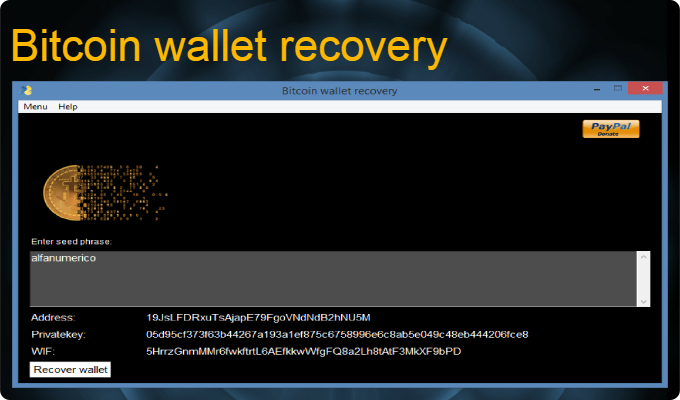
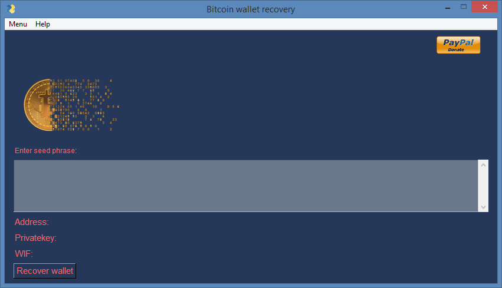
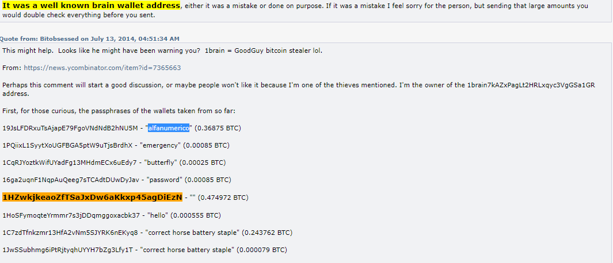

# Bitcoin brainwallet recovery tool
[](https://www.python.org/)

[](https://github.com/adrijano/Bitcoin-brainwallet-recovery/)

[](https://github.com/adrijano/Bitcoin-brainwallet-recovery/graphs/commit-activity)




[](https://www.paypal.com/donate/?cmd=_s-xclick&hosted_button_id=PFB6A6HLAQHC2&source=url)

# If you like it give it a star

[](https://github.com/adrijano/Bitcoin-brainwallet-recovery/)

**Programmed in Python | PySimpleGUI**

# How it works
```
From seed phrase create bitcoin
privatekey and then convert it to Wallet Interchange Format key (WiF) format, 
which is a Base-58 form for the random key. 
This is the format that is stored in the Bitcoin Wallet. 


For example a sample private key is generated from:

seed phrase:   alfanumerico

Privatekey:  

05d95cf373f63b44267a193a1ef875c6758996e6c8ab5e049c48eb444206fce8

We then convert this into WiF format (Base-58):

5HrrzGnmMMr6fwkftrtL6AEfkkwWfgFQ8a2Lh8tAtF3MkXF9bPD

This can be stored in a Bitcoin wallet. Next we can take then private key and a 
hash value, and covert it into a useable Bitcoin address, such as:

19JsLFDRxuTsAjapE79FgoVNdNdB2hNU5M

The format of the keys is defined below, where we create a 256-bit private key 
and convert this to a WiF private key. Next we generate a 512-bit public key, 
and then take a 160-bit RIPEM-160 hash and convert to a Bitcoin address:

```


# How to use

### Python3+
```
git clone https://github.com/adrijano/Bitcoin-brainwallet-recovery.git

cd Bitcoin-brainwallet-recovery && pip install -r requirements.txt

python3 bwr.py
```


### Windows
```
cd dist 
bwr.exe

```
## Sample

Wallet is saved in Wallet.docx

```
-------------------------------------------------------------------------------------------------------------------------------

Wallet: 


seed phrase:  alfanumerico

Address:    19JsLFDRxuTsAjapE79FgoVNdNdB2hNU5M

Privatekey: 05d95cf373f63b44267a193a1ef875c6758996e6c8ab5e049c48eb444206fce8

Publickey:  046eb8003a20926240dd969929650ac85dc28dcd1a7651c2c39d020c2977704ba4f74ff0ad50361aa7c557d962ccccde34cf7ed7a85e10440c40647c6d17f5b08d

WIF:        b'5HrrzGnmMMr6fwkftrtL6AEfkkwWfgFQ8a2Lh8tAtF3MkXF9bPD'
-------------------------------------------------------------------------------------------------------------------------------

Wallet: 


seed phrase: 
  
Address:    1HZwkjkeaoZfTSaJxDw6aKkxp45agDiEzN

Privatekey: e3b0c44298fc1c149afbf4c8996fb92427ae41e4649b934ca495991b7852b855

Publickey:  04a34b99f22c790c4e36b2b3c2c35a36db06226e41c692fc82b8b56ac1c540c5bd5b8dec5235a0fa8722476c7709c02559e3aa73aa03918ba2d492eea75abea235

WIF:        b'5KYZdUEo39z3FPrtuX2QbbwGnNP5zTd7yyr2SC1j299sBCnWjss'
-------------------------------------------------------------------------------------------------------------------------------

```





## Donations
If you would like to support me, donations are very welcome.

```
You can use Paypal to donate using your own credit card. 
The payment is processed by PayPal but you don't need to have a
PayPal account or sign-up for one if you are paying by credit card.

You can also use your own Paypal account to donate.
```
[](https://www.paypal.com/donate/?cmd=_s-xclick&hosted_button_id=PFB6A6HLAQHC2&source=url)

[](https://github.com/adrijano/Bitcoin-brainwallet-recovery/)


# Disclaimer


**The code within this repository comes with no guarantee, the use of this code is your responsibility. I take NO responsibility and/or liability for how you choose to use any of the source code available here. By using any of the files available in this repository, you understand that you are AGREEING TO USE AT YOUR OWN RISK. Once again, ALL files available here are for EDUCATION and/or RESEARCH purposes ONLY.**


